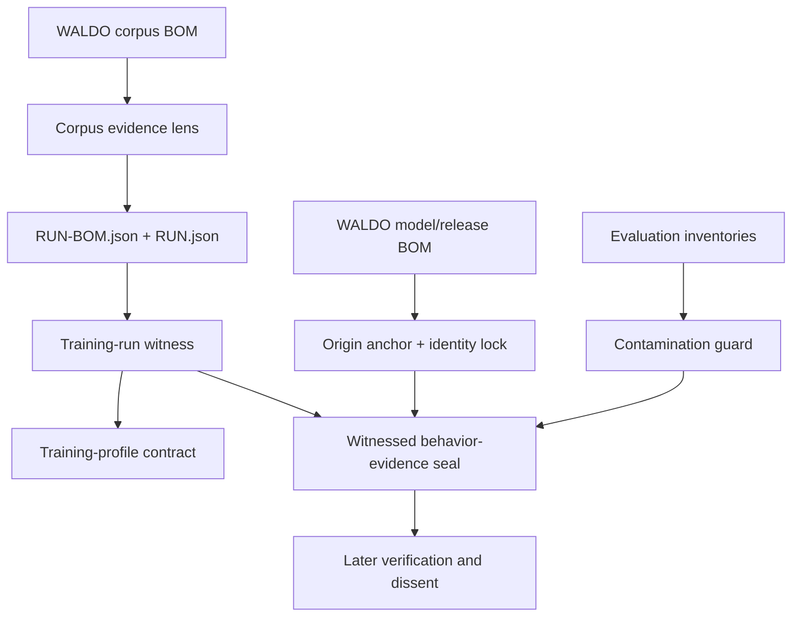

# AXM Mirror research on a WALDO fork

**Status: EXPERIMENTAL / public-safe downstream research / not affiliated with or endorsed by OpenWALDO**

This repository is a GitHub-recognized fork of OpenWALDO's `waldo` project used
by AXM to test one narrow question:

> Can WALDO's inspectable model lineage be extended downstream with equally
> inspectable evidence about a model's concrete behavior, permissions,
> verification, dissent, and observed outcome?

This is not the full AXM Mirror system. The public AXM `mirror` branch contains
substantially more research, and additional local/private Mirror material is not
being copied here. This fork intentionally starts with a small public-safe slice.

## Upstream boundary

OpenWALDO/WALDO remains the upstream project and source of the corpus, training,
model, and release BOM architecture used here. AXM is not claiming affiliation,
partnership, endorsement, or ownership of OpenWALDO.

The upstream Apache-2.0 `LICENSE` and `NOTICE` remain intact.

## Implemented witness slices

The branch `axm/mirror-waldo-experiment-v0.1` adds a fork-only Go package and a
small separate CLI. The current deterministic path is:



Build after installing the Go version required by WALDO:

```bash
go build ./cmd/waldo-axm-mirror
```

Project a WALDO corpus BOM into the bounded evidence surface:

```bash
./waldo-axm-mirror lens-corpus examples/axm-mirror/corpus-bom.json /tmp/example.corpus-lens.json
```

Bind its immutable run plan to the current durable run record:

```bash
./waldo-axm-mirror witness-run examples/axm-mirror/run-bom.json examples/axm-mirror/run.json /tmp/example.run-witness.json
```

Project the exact behavior-named or historical training-selection contract
without rewriting the run BOM:

```bash
./waldo-axm-mirror profile-contract examples/axm-mirror/run-bom.json /tmp/example.run-witness.json /tmp/example.profile-contract.json
```

The checked-in example deliberately uses historical `causal-pretrain-v1`; the
receipt preserves that declaration and resolves its canonical behavior as
`causal-pretrain-shuffled` with state `LEGACY_ALIAS_WITNESSED`.

Anchor a WALDO-produced model or release BOM. All checked-in files are
contract-only examples with placeholder digests and observations, not a
trained model or claim that the named backend actually ran:

```bash
./waldo-axm-mirror anchor examples/axm-mirror/model-release-bom.json /tmp/example.anchor.json
```

Refuse silent answering-identity drift by comparing an expected anchor with a
freshly observed BOM:

```bash
./waldo-axm-mirror lock /tmp/example.anchor.json examples/axm-mirror/model-release-bom.json /tmp/example.lock.json
```

Check exact declared training/evaluation overlap:

```bash
./waldo-axm-mirror contamination examples/axm-mirror/evaluation-comparison.json /tmp/example.contamination.json
```

For a run-backed model or release, seal a draft only after the model, run, and
corpus identities all match their deterministic receipts:

```bash
./waldo-axm-mirror seal-witnessed /tmp/example.anchor.json /tmp/example.run-witness.json examples/axm-mirror/evidence-draft.json /tmp/evidence.sealed.json
```

`seal-anchored` remains the correct path for an origin-backed model that has no
WALDO training run. The original contract-only `seal` command also remains
available for isolated schema tests:

```bash
./waldo-axm-mirror seal-anchored /tmp/example.anchor.json examples/axm-mirror/evidence-draft.json /tmp/evidence.anchored.json
./waldo-axm-mirror seal examples/axm-mirror/evidence-draft.json /tmp/evidence.unanchored.sealed.json
```

Verify it later:

```bash
./waldo-axm-mirror verify /tmp/evidence.sealed.json
```

Receipt writes are atomic and refuse to replace an existing output path. Use a
new output name, or remove an old disposable example deliberately before
rerunning a command.

## Truth boundary

These slices do **not** train a Mirror clone yet. They complete the first
deterministic provenance/evidence chain needed before local model experiments
can be recorded honestly.

They do not grant tool access, run a model, verify the artifact bytes merely by
reading their BOM entries, certify safety or legal usability, convert dissent
into a score, expose hidden reasoning, prove that a selected source caused an
output, or make any AXM result CANON.

## Next experimental rungs

1. Review and project the current upstream corpus and model-interaction additions
   recorded as HOLDs in `research/openwaldo-upstream-delta-2026-08-22.json`.
2. Bind a real WALDO-produced corpus, run, and model/release chain to a behavior
   record; the checked-in chain is intentionally synthetic.
3. Add a bounded read-only provenance context surface and source-claim gate.
4. Add a small public-safe Mirror evaluation fixture set without private memory
   or hidden reasoning.
5. Run a local model through bounded scenarios and preserve outputs by digest.
6. Compare exact releases without flattening behavior, verification, and dissent
   into one score.
7. Only then evaluate whether a small WALDO-trained Mirror research clone is
   technically and legally appropriate for the selected corpus.

Large or upstream-facing changes stay out until this fork has something tested
and useful to show.
