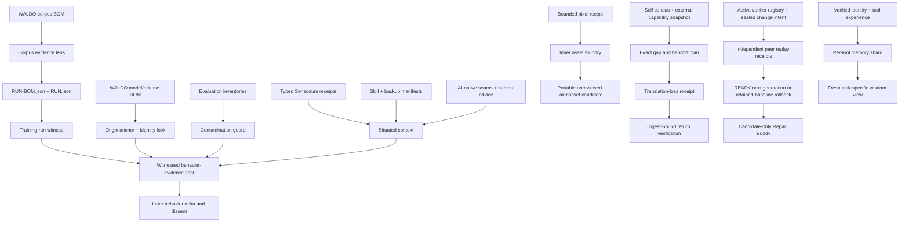

# AXM Mirror research on a WALDO fork

**Status: EXPERIMENTAL / public-safe downstream research / not affiliated with or endorsed by OpenWALDO**

This repository is a GitHub-recognized fork of OpenWALDO's `waldo` project used
by AXM to test one narrow question:

> Can WALDO's inspectable model lineage be extended downstream with equally
> inspectable evidence about a model's concrete behavior, permissions,
> verification, dissent, and observed outcome?

This is not the full AXM Mirror system. The public AXM `mirror` branch contains
substantially more research, and additional local/private Mirror material is not
being copied here. This fork intentionally starts with a small public-safe slice.

## Upstream boundary

OpenWALDO/WALDO remains the upstream project and source of the corpus, training,
model, and release BOM architecture used here. AXM is not claiming affiliation,
partnership, endorsement, or ownership of OpenWALDO.

The upstream Apache-2.0 `LICENSE` and `NOTICE` remain intact.

The inherited v0.6 stack merges the exact OpenWALDO head
`451e029abd1f74fd77625984526a1980c48fb477`. The merge and its downstream
compatibility work are recorded in ADR 9009 and
`research/openwaldo-upstream-alignment-2026-08-16.json`; neither upstream
`main` nor this fork's `main` is changed. The stacked v0.7 layer in ADR 9010
adds mutually checked verifier candidates, fail-safe rollback, Repair Buddy,
and identity-scoped tool wisdom. Its organ-map overlay keeps the remaining
continuity and specialist-growth surfaces explicit.

## Implemented witness slices

The stacked `axm/mirror-waldo-experiment-*` branches add a fork-only Go package
and a small separate CLI. The current deterministic path is:



Build after installing the Go version required by WALDO:

```bash
go build ./cmd/waldo-axm-mirror
```

Project a WALDO corpus BOM into the bounded evidence surface:

```bash
./waldo-axm-mirror lens-corpus examples/axm-mirror/corpus-bom.json /tmp/example.corpus-lens.json
```

Current output uses corpus-lens v0.2 and binds WALDO record-filter,
content-assessment, main-content-era writer, and privacy-redaction evidence.
The checked example remains a legacy schema-1 input on purpose, so its receipt
shows the absence of newer facts instead of inventing them. Legacy v0.1 lens
receipts remain validation-compatible.

Bind its immutable run plan to the current durable run record:

```bash
./waldo-axm-mirror witness-run examples/axm-mirror/run-bom.json examples/axm-mirror/run.json /tmp/example.run-witness.json
```

Anchor a WALDO-produced model or release BOM. All checked-in files are
contract-only examples with placeholder digests and observations, not a
trained model or claim that the named backend actually ran:

```bash
./waldo-axm-mirror anchor examples/axm-mirror/model-release-bom.json /tmp/example.anchor.json
```

Refuse silent answering-identity drift by comparing an expected anchor with a
freshly observed BOM:

```bash
./waldo-axm-mirror lock /tmp/example.anchor.json examples/axm-mirror/model-release-bom.json /tmp/example.lock.json
```

Check exact declared training/evaluation overlap:

```bash
./waldo-axm-mirror contamination examples/axm-mirror/evaluation-comparison.json /tmp/example.contamination.json
```

For a run-backed model or release, seal a draft only after the model, run, and
corpus identities all match their deterministic receipts:

```bash
./waldo-axm-mirror seal-witnessed /tmp/example.anchor.json /tmp/example.run-witness.json examples/axm-mirror/evidence-draft.json /tmp/evidence.sealed.json
```

`seal-anchored` remains the correct path for an origin-backed model that has no
WALDO training run. The original contract-only `seal` command also remains
available for isolated schema tests:

```bash
./waldo-axm-mirror seal-anchored /tmp/example.anchor.json examples/axm-mirror/evidence-draft.json /tmp/evidence.anchored.json
./waldo-axm-mirror seal examples/axm-mirror/evidence-draft.json /tmp/evidence.unanchored.sealed.json
```

Verify it later:

```bash
./waldo-axm-mirror verify /tmp/evidence.sealed.json
```

### Situated clone boundary

The Wave 2.1 path adds receipt-only situation around the existing provenance
and evaluation gates:

```text
intake-sensory + assess-skills + discover
  -> situated-context
  -> seal-situated
  -> verify
```

It recognizes all thirteen public Workshop Sensorium contracts without copying
their executors. It keeps passive organ knowledge, portable skill instructions,
and executable adapters as different inventory roles. It also preserves the
Mirror discovery asymmetry: AI-native seams are primary; human usefulness,
accessibility, craft, and product-soul review is explicit, secondary, advisory,
and unable to close native seams.

The exact public contract sources and claim ceilings are pinned in
`research/mirror-situated-knowledge-sources-2026-08-15.json`. The 115-organ
archive remains inert knowledge and no Workshop or Mirror JavaScript is
imported or executed.

### Inner asset foundry

The Wave 2.2 path adds one deliberately small creation substrate without
copying the Workshop or full Asset Factory:

```text
strict pixel recipe
  -> deterministic Go compiler
  -> normalized recipe + resolved grid + primary PNG + preview PNG + atlas
  -> candidate-only portable .axmasset
  -> full digest verification and deterministic recompilation
```

```bash
./waldo-axm-mirror forge-asset examples/axm-mirror/inner-asset-recipe.json /tmp/witness-orb.axmasset
./waldo-axm-mirror verify-asset /tmp/witness-orb.axmasset
```

Recipes contain only bounded pixel primitives, explicit palettes, frames,
semantic/presentation layers, canvas constraints, and a deterministic seed.
They contain no code, prompt, path, URL, external generator, or Asset Hand. A
READY candidate still has `visual_status: UNREVIEWED`; technical PASS is not
visual approval, usefulness, shared-vocabulary admission, promotion, or CANON.

The exact public Asset Factory and visual-contract knowledge sources are pinned
in `research/asset-foundry-knowledge-sources-2026-08-15.json`. ADR 9007 defines
the smaller WALDO-native implementation and its authority ceiling.

### Portable capability spine

The Wave 2.3 path lets the specialist describe a missing capability and prepare
an inspectable external contract without putting the Workshop inside WALDO:

```text
compiled self capability census
  + source-attributed external inventory with explicit freshness
  + exact capability/schema/data-class gap request
  -> review-only handoff plan
  -> explicit translation-loss receipt
  -> digest-bound returned-artifact receipt
```

```bash
./waldo-axm-mirror census-capabilities examples/axm-mirror/self-capability-census-request.json /tmp/waldo-self-capabilities.json
./waldo-axm-mirror intake-capabilities examples/axm-mirror/external-capability-snapshot.json /tmp/platform-capabilities.json
./waldo-axm-mirror plan-handoff /tmp/waldo-self-capabilities.json /tmp/platform-capabilities.json examples/axm-mirror/capability-gap-request.json /tmp/capability-handoff.json
```

The checked external snapshot is deliberately `SOURCE_ONLY`, so the last
command writes `HOLD_EXTERNAL_CAPABILITY_SOURCE_ONLY` and returns nonzero. That
is the honest result: the public platform contracts are known, but no live
Workshop runtime or provider was observed. Tests separately prove a synthetic
fresh LIVE unique-provider path through return verification.

The planner uses exact capability, schema, and data-class matches. It never
selects or invokes a provider, inherits a permission, generates an adapter, or
turns source declarations into readiness. Translation receipts say
`NO_DECLARED_LOSS`, not “lossless,” and returned digests are not content or
visual approval. The source contracts and ceilings are pinned in
`research/portable-capability-spine-knowledge-sources-2026-08-15.json`; ADR
9008 defines the smaller WALDO-native contract.

### Mutual verifier evolution and Repair Buddy

The Wave 2.4 path lets verifier definitions evolve without letting a changed
verifier approve itself:

```text
sealed current registry + sealed candidate intent
  + two current peers from two independent groups
  + one frozen fixture/protocol and exact replay-result consensus
  -> READY next-generation candidate
  or -> HOLD / ROLLBACK to the still-active current generation
```

```bash
./waldo-axm-mirror assess-verifier-change examples/axm-mirror/verifier-registry.json examples/axm-mirror/verifier-change-request.json /tmp/verifier-change.ready.json
./waldo-axm-mirror materialize-verifier-change examples/axm-mirror/verifier-registry.json /tmp/verifier-change.ready.json /tmp/verifier-registry.next.json
```

The invariant kernel is compiled outside the changing set. It fixes
no-self-approval, two-peer/two-group quorum, exact current-definition binding,
frozen shadow evidence, zero regressions, retained rollback generations,
protected-change Merge Gate review, and closed authority. READY materializes a
candidate file to a new no-replace path; it does not activate a runtime
registry.

The regression example deliberately returns nonzero after writing a
`ROLLBACK_PEER_REJECTED` receipt. Because no active pointer moved, rollback
means retaining the exact current registry rather than overwriting history:

```bash
./waldo-axm-mirror assess-verifier-change examples/axm-mirror/verifier-registry.json examples/axm-mirror/verifier-change-regression-request.json /tmp/verifier-change.failed.json
./waldo-axm-mirror plan-verifier-repair examples/axm-mirror/verifier-registry.json /tmp/verifier-change.failed.json examples/axm-mirror/repair-buddy-request.json /tmp/verifier-repair.plan.json
```

Repair Buddy reassesses the failed receipt, contains the candidate, diagnoses
the typed failure, and proposes a bounded next action. Simulation,
authorization, repair, verification, and learning remain blocked until a new
intent passes the original independent gates. Repair Buddy contains no patch,
installer, activation, promotion, or CANON path.

### Identity-scoped tool wisdom

The Wave 2.5 path stores verified experience in one exact answering-identity,
tool-ID, and tool-version shard, then recalls only the relevant slice:

```text
artifact digests + tool receipt + independent verification
  -> compact REUSE or AVOID distillation
  -> append-only per-tool shard
  -> exact task-class + use-tag + TTL query
  -> at most eight fresh model-facing lessons
```

```bash
./waldo-axm-mirror seal-tool-experience examples/axm-mirror/identity-tool-experience-draft.json /tmp/tool-experience.json
./waldo-axm-mirror start-tool-memory /tmp/tool-experience.json /tmp/tool-memory.json
./waldo-axm-mirror recall-tool-wisdom /tmp/tool-memory.json examples/axm-mirror/identity-wisdom-query.json /tmp/tool-wisdom.json
```

Only independently verified success or independently verified failure can be
appended. The shard refuses cross-identity/tool/version growth, duplicates,
backdated entries, raw prompts, payloads, outputs, hidden reasoning, and
secrets. Stale entries are omitted. The model sees the bounded wisdom view, not
the entire shard or a cross-tool blob. This is selective evidence context, not
hidden weight training or proof of general competence.

Receipt writes are atomic and refuse to replace an existing output path. Use a
new output name, or remove an old disposable example deliberately before
rerunning a command.

## Truth boundary

These slices do **not** train a Mirror clone yet. They complete deterministic
provenance, evaluation, and situated-evidence boundaries needed before local
model experiments can be recorded honestly.

They do not grant capture or tool access, install or restore skills, run a
model, verify artifact bytes merely by reading BOM entries, certify safety or
legal usability, convert discovery or dissent into a score, expose hidden
reasoning, invoke or select an external capability provider, infer schema
semantics or permissions, approve or install an asset, execute peer-verifier
digests, activate a verifier generation, repair code, convert tool memory into
model weights, or make any AXM result CANON.

## Next experimental rungs

1. Bind a real WALDO-produced corpus, run, and model/release chain to a behavior
   record; the checked-in chain is intentionally synthetic.
2. Add a small public-safe Mirror evaluation fixture set without private memory
   or hidden reasoning.
3. Run a local model through bounded scenarios and preserve outputs by digest.
4. Compare exact releases without flattening behavior, verification, discovery,
   and dissent into one score.
5. Add append-only dissent continuity and a Reproducibility Twin.
6. Let a bounded specialist propose pixel recipes against the inner foundry and
   evaluate the resulting candidates under explicit human visual review.
7. Add resource leases and real provider transport only as separately
   permissioned contracts; keep provider selection and execution outside the
   learned clone.
8. Add a portable continuity capsule spanning active verifier generation,
   task state, memory-shard catalog, evidence freshness, and open dissent.
9. Add specialist-need classification, reviewed memory compaction, and
   authenticated external generation activation without giving those gates to
   the learned clone.
10. Add artifact-byte or visual verification as
   separate evidence, not upgrades to handoff metadata.
11. Only then evaluate whether a small WALDO-trained Mirror research clone is
   technically and legally appropriate for the selected corpus.

Large or upstream-facing changes stay out until this fork has something tested
and useful to show.
