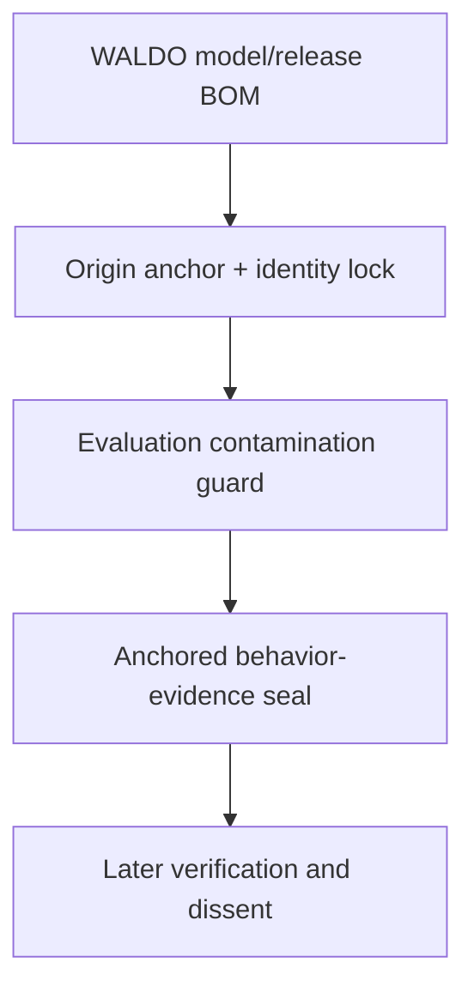

# AXM Mirror research on a WALDO fork

**Status: EXPERIMENTAL / public-safe downstream research / not affiliated with or endorsed by OpenWALDO**

This repository is a GitHub-recognized fork of OpenWALDO's `waldo` project used
by AXM to test one narrow question:

> Can WALDO's inspectable model lineage be extended downstream with equally
> inspectable evidence about a model's concrete behavior, permissions,
> verification, dissent, and observed outcome?

This is not the full AXM Mirror system. The public AXM `mirror` branch contains
substantially more research, and additional local/private Mirror material is not
being copied here. This fork intentionally starts with a small public-safe slice.

## Upstream boundary

OpenWALDO/WALDO remains the upstream project and source of the corpus, training,
model, and release BOM architecture used here. AXM is not claiming affiliation,
partnership, endorsement, or ownership of OpenWALDO.

The upstream Apache-2.0 `LICENSE` and `NOTICE` remain intact.

## Implemented witness slices

The branch `axm/mirror-waldo-experiment-v0.1` adds a fork-only Go package and a
small separate CLI. The current deterministic path is:



Build after installing the Go version required by WALDO:

```bash
go build ./cmd/waldo-axm-mirror
```

Anchor a WALDO-produced model or release BOM. The checked-in file is a
contract-only example with placeholder digests, not a trained model:

```bash
./waldo-axm-mirror anchor examples/axm-mirror/model-release-bom.json /tmp/example.anchor.json
```

Refuse silent answering-identity drift by comparing an expected anchor with a
freshly observed BOM:

```bash
./waldo-axm-mirror lock /tmp/example.anchor.json examples/axm-mirror/model-release-bom.json /tmp/example.lock.json
```

Check exact declared training/evaluation overlap:

```bash
./waldo-axm-mirror contamination examples/axm-mirror/evaluation-comparison.json /tmp/example.contamination.json
```

Seal a draft only after its release or model BOM digest matches an anchor:

```bash
./waldo-axm-mirror seal-anchored /tmp/example.anchor.json examples/axm-mirror/evidence-draft.json /tmp/evidence.sealed.json
```

The original contract-only seal command remains available:

```bash
./waldo-axm-mirror seal examples/axm-mirror/evidence-draft.json /tmp/evidence.unanchored.sealed.json
```

Verify it later:

```bash
./waldo-axm-mirror verify /tmp/evidence.sealed.json
```

Receipt writes are atomic and refuse to replace an existing output path. Use a
new output name, or remove an old disposable example deliberately before
rerunning a command.

## Truth boundary

These slices do **not** train a Mirror clone yet. They create the downstream
provenance/evidence contract needed before local model experiments can be
recorded honestly.

They do not grant tool access, run a model, verify the artifact bytes merely by
reading their BOM entries, certify safety or legal usability, convert dissent
into a score, expose hidden reasoning, or make any AXM result CANON.

## Next experimental rungs

1. Add the Corpus Evidence Lens and Training Run Witness organs so a real
   behavior receipt can traverse more than the model/release boundary.
2. Bind a real WALDO-produced model or release BOM to a behavior-evidence record.
3. Add a small public-safe Mirror evaluation fixture set without private memory
   or hidden reasoning.
4. Run a local model through bounded scenarios and preserve outputs by digest.
5. Record permission state, deterministic checks, unresolved dissent, and result.
6. Only then evaluate whether a small WALDO-trained Mirror research clone is
   technically and legally appropriate for the selected corpus.

Large or upstream-facing changes stay out until this fork has something tested
and useful to show.
