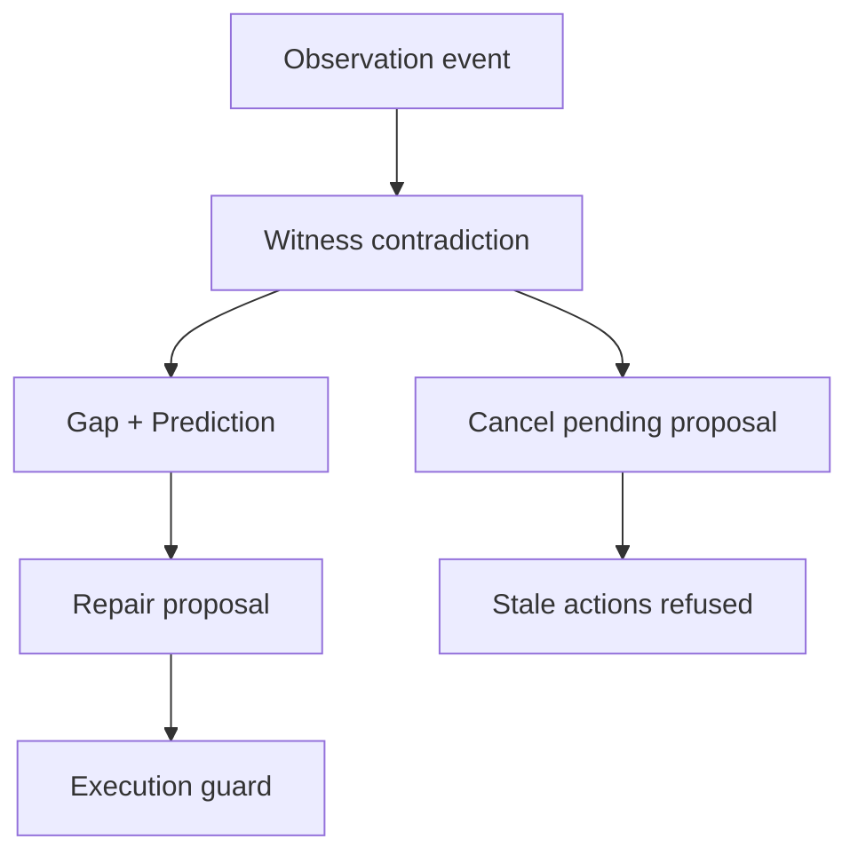

# v0.25 architecture — bounded coupled reasoning and local execution guard

## Components

| Component | Sequential A | Coupled B | Authority |
|---|---|---|---|
| Scenario fixture | Shared seeded input | Shared seeded input | None |
| Simulator | Same arm, target, disturbances, scoring | Same arm, target, disturbances, scoring | Mutated only by guard-approved actions and declared disturbances |
| Perception | Fixed observation stage | Observation-event publisher | None |
| Builder | Completes a plan stage | Reacts when no active proposal exists | Proposes only |
| Witness | Runs at fixed stage boundaries | Subscribes to observations and proposal state | Contradicts/cancels proposals; cannot execute |
| Gap / Prediction | Explicitly called after fixed contradiction handling | Independently recruited by contradiction events | Evidence only |
| Repair | Explicitly called after fixed Gap/Prediction | Recruited when both causal inputs exist | Revises proposals only |
| Opinion | Not needed for baseline control flow | Appends dissent assessment | `NONE`; cannot execute/promote |
| Execution Control | Fixed action stage | Subscribes to due-action events | Requests guard checks only |
| Execution Guard | Shared exact-envelope boundary | Shared exact-envelope boundary | Sole simulated actuator route |

## Coupled causal flow

The event plane is a deterministic priority queue ordered by logical time and insertion sequence. Roles subscribe to semantic event kinds. External disturbances are scheduled independently from reasoning work. A proposal identity is the concurrency token: proposal-mutating events that no longer match the active identity become append-only `STALE_WRITE_REJECTED` evidence.

## Ledger contract

Every processed event contains:

- a monotonic `seq`;
- deterministic `logicalTime`;
- `emitter` and `kind`;
- earlier-only `causalParents`;
- state versions before and after;
- a chained `stateDigest` including the prior event digest;
- an `eventDigest` sealing the event.

The receipt reports required fields, missing fields, causal validity, event count, and the complete ledger digest. Runtime validation recomputes both digest layers.

## Bounds and anti-loop controls

The fixture sets explicit maximums for logical ticks, events, queued events, reconsiderations, and executed actions. Duplicate keys are suppressed. Stale proposal writes are rejected. Missing evidence or exhausted reconsideration enters `HOLD`; no conflict is silently deleted. FIFO ordering is used for equal logical times—no reasoning role receives permanent dominance.

Pathologies are measurements:

- `oscillation_count`;
- `event_storm`;
- `stale_writes_rejected`;
- `starvation`;
- `duplicate_events_suppressed`;
- `false_contradictions`;
- queue overflow and timeout;
- event/reasoning/resource overhead.

Zero is preserved rather than omitted.

## Execution boundary

The event plane never owns a permit. `ExecutionGuard` constructs one immutable envelope from the scenario before the run and offers only `check`, `execute`, and authority-reducing `revoke` operations. Each micro-action is rechecked. Revocation is prospective and append-only evidence retains prior executions.

The simulated permit does not generalize beyond its named environment, capability, scope, route, run, or action budget.

## Timing and repeatability

Logical ticks measure comparable causal latency. They are deterministic.

Wall-clock nanoseconds, process CPU nanoseconds, `tracemalloc` peak bytes, and RSS high-water observations measure this host execution. They are nondeterministic and excluded from semantic digests. Repeatability means semantic outputs match across identical fixture reruns; it does not mean machine timing is identical.

